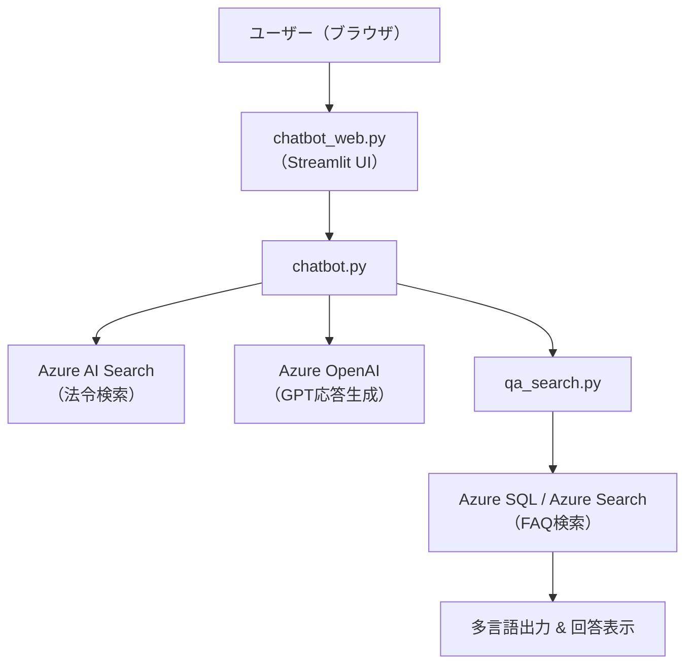

# 📘 Multilingual Subcontract Law Chatbot（下請法チャットボット）

外国籍ユーザーを含むすべての利用者が、日本の「下請代金支払遅延等防止法（下請法）」について分かりやすく質問できる、多言語対応の法令チャットボットです。

## 🎯 概要

本プロジェクトは、自然言語での質問から下請法に関する法令検索・要点説明・Q&A参照を可能にする会話型AIチャットシステムです。日本語・英語の両方に対応し、法律に不慣れな人でも平易な言葉で情報にアクセスできます。

## 🌐 特徴

- ✅ 日本語・英語の自動判定・双方向翻訳
- ✅ Azure OpenAI によるわかりやすい法令解説
- ✅ Azure Cognitive Search による法令条文・FAQの意味検索
- ✅ Azure SQL または Azure Search によるQ&Aマッチング
- ✅ Streamlit UI による直感的な対話画面
- ✅ 法律相談ではない旨の注意書きも表示

## 🛠️ 技術スタック

- Azure OpenAI (GPT 3.5 Turbo) – 回答生成
- Azure AI Search – 法令・FAQの意味検索
- Azure SQL Database – 類似Q&Aの管理
- Langdetect / Googletrans – 言語検出・翻訳
- Streamlit – チャット画面UI
- Python / pyodbc / dotenv – 全体実装

## 🧱 技術スタック（Tech Stack）

| カテゴリ | 使用技術 |
|----------|------------|
| フロントエンド | Streamlit |
| バックエンド | Python |
| AIモデル | Azure OpenAI（ChatGPT Turbo） |
| 法令検索 | Azure AI Search（Cognitive Search） |
| Q&A検索 | Azure SQL Database / Azure AI Search |
| 翻訳対応 | `langdetect`, `googletrans` |
| データ構造変換 | JSON / CSV / XML 解析（`xml_parser.py`） |

---

## 🧭 システム構成図（Mermaid）

## 📁 ディレクトリ構成（抜粋）
chatbot_dev/
└── chatbot_project/
    ├── __pycache__/                     # Pythonキャッシュファイル（自動生成）
    ├── data/                            # データ処理・前処理・アップロード用スクリプトなど
    │   ├── check_index_data.py          # Azure Search にアップロードされたデータの確認
    │   ├── faq_csv_to_json.py           # FAQ CSV を JSON に変換（Azure Search用）
    │   ├── faq.json                     # FAQデータ（JSON形式）Azure Searchへ登録するための元データ
    │   ├── law_data.xml                 # 元の法令XMLデータ
    │   ├── parsed_law.json              # XMLを解析して生成した法令のJSON形式データ
    │   ├── upload_faq_to_azure.py       # FAQをAzure Searchにアップロードするスクリプト
    │   ├── upload_to_azure.py           # 法令データをAzure Searchにアップロードするスクリプト
    │   └── xml_parser.py                # 法令のXMLを読み取り、JSON形式に変換するパーサー
    ├── database/                        # Q&A検索に関するデータベース操作モジュール
    │   ├── __pycache__/                 # Pythonキャッシュファイル（自動生成）
    │   ├── database_upload.py           # Q&AデータをAzure SQLにアップロードする処理
    │   └── qa_search.py                 # Q&A検索の処理ロジック（翻訳・意味検索対応）
    ├── venv/                            # Python仮想環境
    ├── .env                             # 環境変数の設定（APIキーや接続文字列など）
    ├── .env.example                     # .envのサンプルテンプレート
    ├── .gitignore                       # Gitで無視するファイルの設定
    ├── chatbot_web.py                   # Streamlit UI（チャット画面のWebアプリ本体）
    ├── chatbot.py                       # 法令検索・GPT応答生成の中核処理
    ├── database_upload.py               # Q&Aデータベースへの一括アップロード（旧版・統合可能）
    ├── FAQ_Data.csv                     # 元となるQ&A CSVデータ
    ├── README.md                        # プロジェクトの説明書
    ├── requirements.txt                 # 使用ライブラリ一覧（pip用）
    ├── scraper.py                       # （未使用 or 将来用）データ収集スクリプト
    ├── search_azure.py                  # Azure Searchの検索テスト用スクリプト
    ├── setup_project.py                 # 開発環境セットアップ用（DB準備など）
    └── sitauke_qa.html                  # 下請法に関する資料・参考ページ（HTML形式）

## データ出典
本チャットボットで使用している法令・FAQデータは、以下の信頼性ある公的機関から取得したものです。

e-Gov 法令API（下請代金支払遅延等防止法）
提供元：e-Gov（総務省）
URL：https://laws.e-gov.go.jp/api/1/lawdata/331AC0000000120

Q&A よくある質問コーナー（下請法）
提供元：公正取引委員会
URL：https://www.jftc.go.jp/shitauke/sitauke_qa.html
